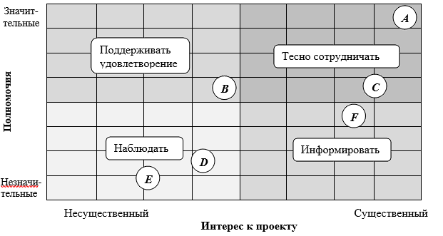

МАТРИЦА АНАЛИЗА ВЛИЯНИЯ ЗАИНТЕРЕСОВАННЫХ СТОРОН ПРОЕКТА И СТРАТЕГИИ

УПРАВЛЕНИЯ ИМИ

+-----------------------------------------------------------------------+

| \*\*Титульная информация о проекте\*\*                                    |

|                                                                       |

| +---------------------+-------------------------------------------+   |

| | \*\*Наименование      | \*\*Разработка приложения для контроля и    |   |

| | проекта\*\*           | отслеживания местоположения и маршрутов   |   |

| |                     | передвижения транспортных средств\*\*       |   |

| +=====================+===========================================+   |

| | \*\*Планируемое время | \*\*10.23 -- 05.24\*\*                        |   |

| | начала и окончания  |                                           |   |

| | проекта             |                                           |   |

| | (месяц/год)\*\*       |                                           |   |

| +---------------------+-------------------------------------------+   |

| | \*\*Оценка бюджета    | \*\*50 000\*\*                                |   |

| | проекта (руб.)\*\*    |                                           |   |

| +---------------------+-------------------------------------------+   |

| | \*\*Место/сфера       | Федеральное государственное бюджетное     |   |

| | реализации\*\*        | образовательное учреждение                |   |

| |                     |                                           |   |

| |                     | высшего образования                       |   |

| |                     |                                           |   |

| |                     | \*\*«ГОСУДАРСТВЕННЫЙ УНИВЕРСИТЕТ            |   |

| |                     | УПРАВЛЕНИЯ»\*\*                             |   |

| +---------------------+-------------------------------------------+   |

| | \*\*Заказчик          | \*\*ООО «Атлас Чейн Лаб»\*\*                  |   |

| | проекта\*\*           |                                           |   |

| +---------------------+-------------------------------------------+   |

| | \*\*Руководитель      | \*\*Курноскин В.И.\*\*                        |   |

| | проекта\*\*           |                                           |   |

| +---------------------+-------------------------------------------+   |

| | \*\*Куратор/другие    | \*\*Белоусов В.А.\*\*                         |   |

| | участники проекта\*\* |                                           |   |

| +---------------------+-------------------------------------------+   |

| | \*\*Дата создания     | \*\*20.03.2024\*\*                            |   |

| | документа\*\*         |                                           |   |

| +---------------------+-------------------------------------------+   |

+=======================================================================+

+-----------------------------------------------------------------------+

\*\*Участники/группы участников проекта\*\*

\----------------------------------------------------------------------------------------------

\*\*Код\*\*   \*\*Фамилия, инициалы/Группа\*\*   \*\*Должность\*\*       \*\*Полномочия\*\*   \*\*Интерес\*\*

\--------- ------------------------------ ------------------- ---------------- ----------------

\*\*\*A\*\*\*   \*\*Курноскин В.И.\*\*             \*\*Руководитель\*\*    Значительные     Существенный

\*\*\*B\*\*\*   \*\*ООО\*\* \*\*«Атлас Чейн Лаб»\*\*   \*\*Заказчик\*\*        Значительные     Несущественный

\*\*\*C\*\*\*   \*\*Белоусов В.А.\*\*              \*\*Научный           Значительные     Существенный

руководитель\*\*

\*\*\*D\*\*\*   \*\*Стефановский Д.В.\*\*          \*\*Внешний эксперт\*\* Незначительные   Несущественный

\*\*\*E\*\*\*   \*\*Гусаров Г.А.\*\*               \*\*Потребитель\*\*     Незначительные   Несущественный

\*\*\*F\*\*\*   \*\*Кафедра\*\*                                        Незначительные   Существенный

\----------------------------------------------------------------------------------------------

\*\*Матрица влияния\*\*

\*\*Стратегии управления участниками/группами участников проекта\*\*

\--------------------------------------------------------------------------------------------

\*\*Фамилия, инициалы/Группа\*\*   \*\*Должность\*\*            \*\*Код\*\*   \*\*Стратегия управления\*\*

\------------------------------ ------------------------ --------- --------------------------

\*\*Курноскин В.И.\*\*             \*\*Руководитель\*\*         \*\*\*A\*\*\*   Тесно сотрудничать

\*\*ООО\*\* \*\*«Атлас Чейн Лаб»\*\*   \*\*Заказчик\*\*             \*\*\*B\*\*\*   Поддерживать

удовлетворение

\*\*Белоусов В.А.\*\*              \*\*Научный руководитель\*\* \*\*\*C\*\*\*   Тесно сотрудничать

\*\*Стефановский Д.В.\*\*          \*\*Внешний эксперт\*\*      \*\*\*D\*\*\*   Наблюдать

\*\*Гусаров Г.А.\*\*               \*\*Потребитель\*\*          \*\*\*E\*\*\*   Наблюдать

\*\*Кафедра\*\*                                             \*\*\*F\*\*\*   Информировать

\--------------------------------------------------------------------------------------------

\*\*Составлено/согласовано\*\*

\---------------------------------------------------------------------------

\*\*Должность\*\*           \*\*Фамилия, инициалы\*\*   \*\*Подпись\*\*      \*\*Дата\*\*

\----------------------- ----------------------- ---------------- ----------

Руководитель            Курноскин В.И.

Внешний эксперт         Стефановский Д.В.

\---------------------------------------------------------------------------
